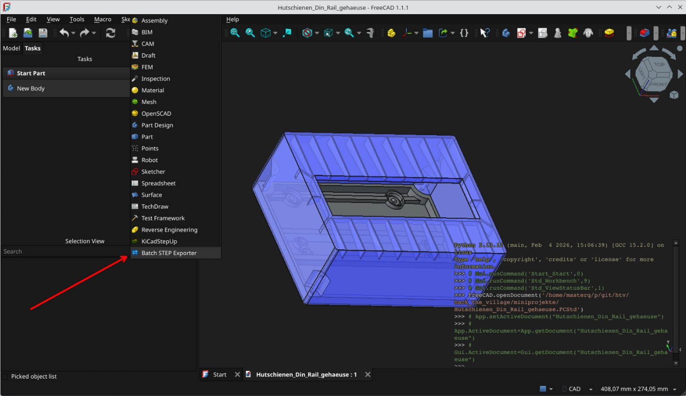
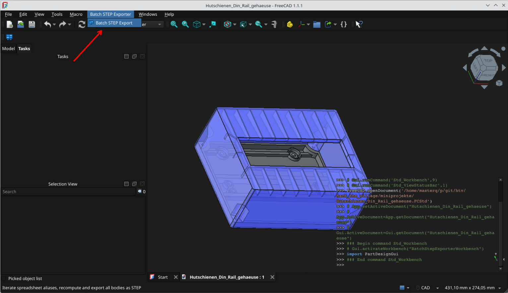
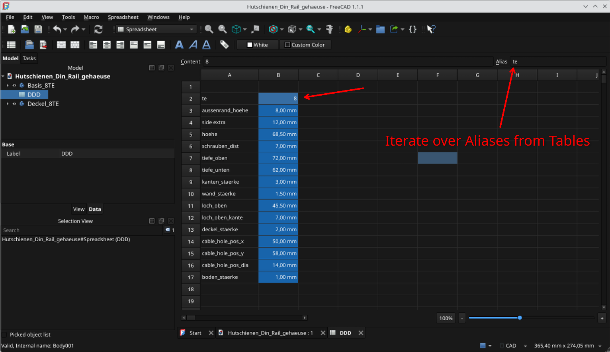
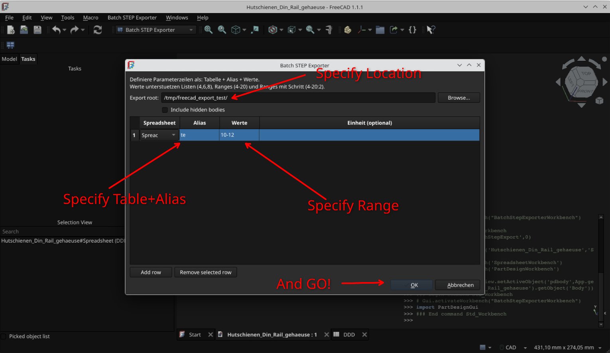
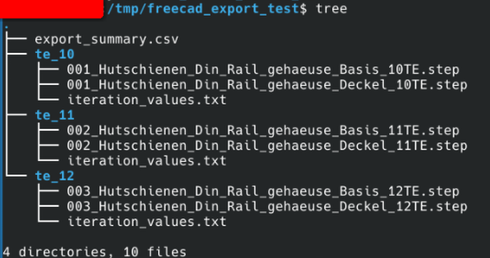

# Batch STEP Exporter for FreeCAD

Batch STEP Exporter is a FreeCAD workbench that automates parametric exports.
It iterates over one or more Spreadsheet aliases, recomputes the model for every parameter combination, and exports every `PartDesign::Body` as an individual STEP file.

Primary use case:

- Publish one project in many parameter variants (for example, cabinet sizes or TE units).

Secondary use case:

- Generate multiple model variants in one run, then batch-print or process them together with almost no manual clicking.

## Features

- Iterate over one or many Spreadsheet aliases.
- Supported value expressions:
  - List: `4,6,8`
  - Range: `4-20`
  - Range with step: `4-20:2`
- Computes the Cartesian product of all parameter rows.
- Recomputes the model for every iteration.
- Exports each `PartDesign::Body` as a separate `.step` file.
- Creates one output folder per parameter combination.
- Writes:
  - `iteration_values.txt` in each iteration folder
  - `export_summary.csv` in export root

## Naming Convention

Folder names:

- Parameter-only format, for example: `te_4_w_600_h_1800_d_500`

STEP file names:

- `IterationNumber_ProjectName_PartName.step`
- Example: `001_Hutschienen_Din_Rail_gehaeuse_Basis_4TE.step`

Notes:

- `ProjectName` is taken from the FreeCAD `.FCStd` file name.
- `IterationNumber` is the global iteration index, not a part index.

## Screenshots

Workbench:



Open command:



Find parameters:



Run export:



Export result:



## Installation (Linux)

1. Close FreeCAD.
2. Copy the addon folder to the FreeCAD user mod directory.

FreeCAD 1.1.x default path:

```bash
mkdir -p ~/.local/share/FreeCAD/v1-1/Mod
cp -r BatchStepExporter ~/.local/share/FreeCAD/v1-1/Mod/BatchStepExporter
```

Some older FreeCAD setups may still use:

```bash
~/.local/share/FreeCAD/Mod
```

1. Start FreeCAD.
2. Select workbench `Batch STEP Exporter`.
3. Run command `Batch STEP Export`.

## Usage

1. Open your model.
2. Ensure relevant Spreadsheet cells have aliases (for example `te`).
3. In the exporter dialog:
   - choose `Export root`
   - add parameter rows (`Spreadsheet`, `Alias`, `Values`, optional `Unit`)
4. Start export.

Example:

- `te`: `4-20`
- `w`: `500,600,700`
- `h`: `1800`
- `d`: `400,500`

This will export all combinations automatically.

## Repository Structure

- `BatchStepExporter/`: FreeCAD addon files
- `docs/screenshots/`: screenshots used in documentation
- `docs/releases/`: release notes

Documentation policy:

- `README.md` is the single maintained source of truth.

## License

This project is released under The Unlicense.
You can use, modify, distribute, and sell it without restrictions.
It is provided "as is", without warranty or liability.
